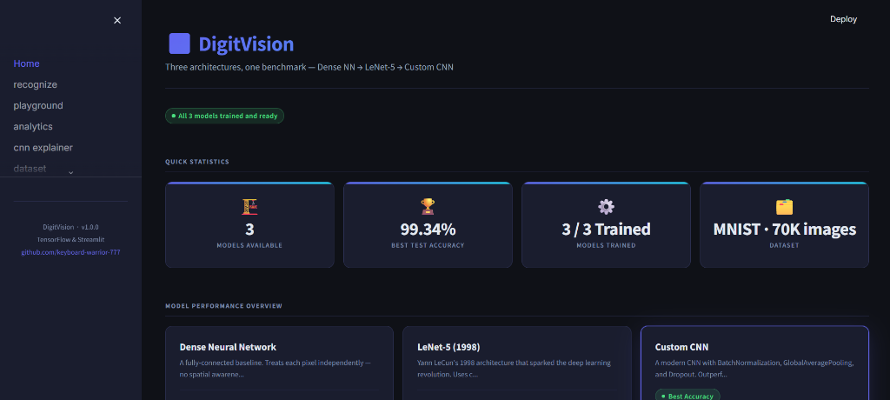
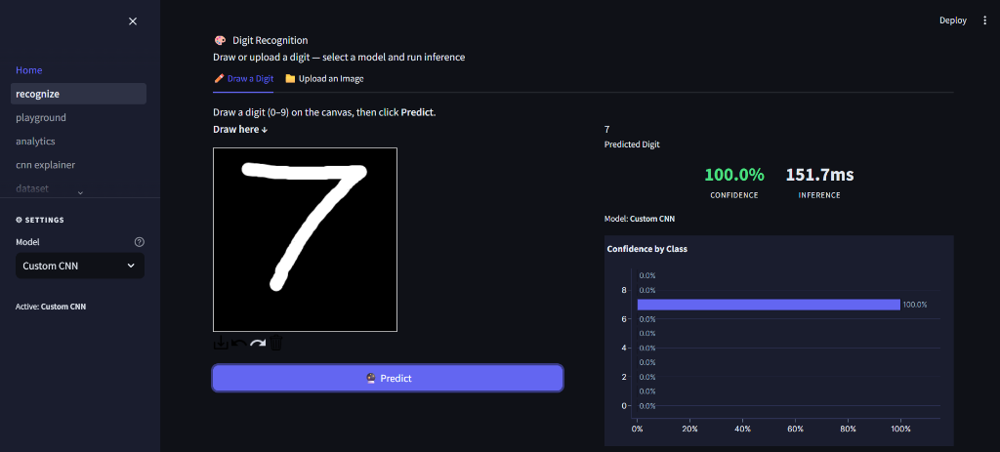
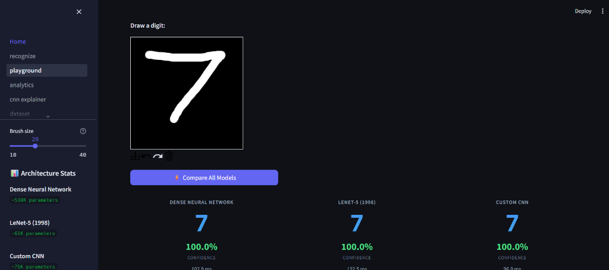
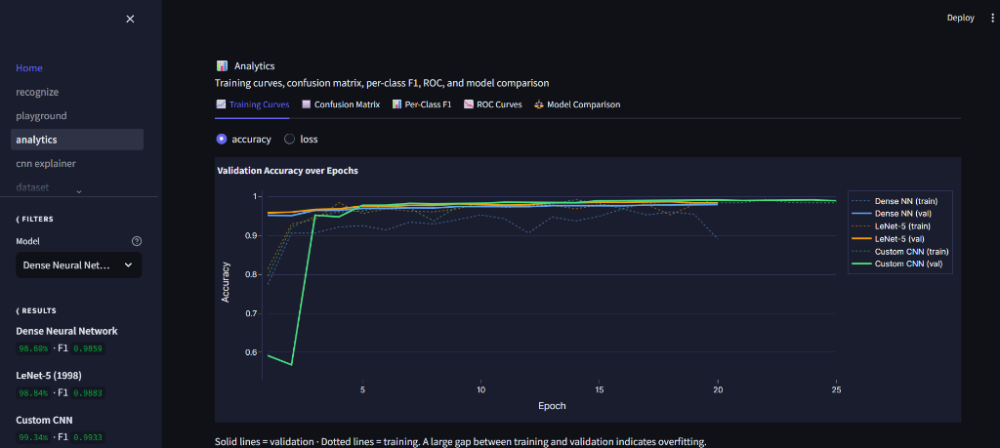
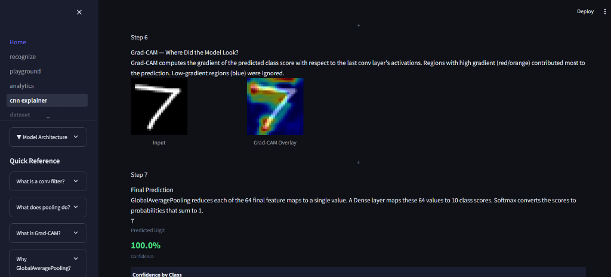
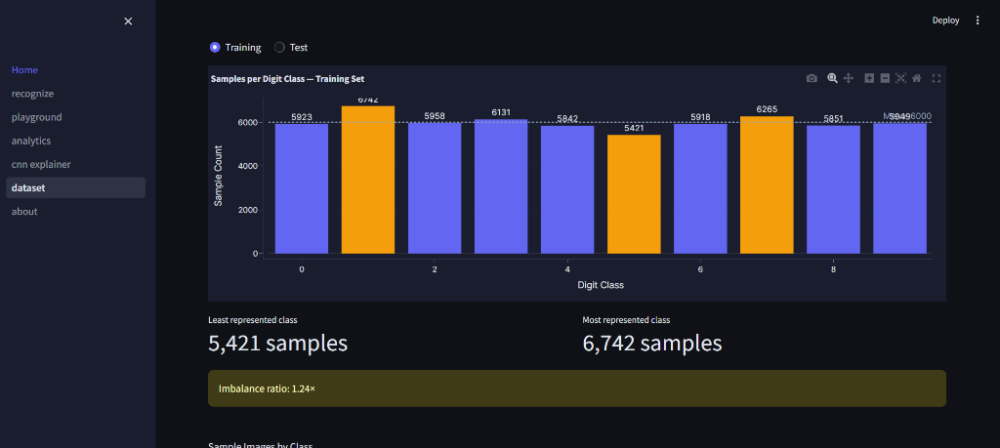

<div align="center">


# DigitVision

### Handwritten Digit Recognition — Deep Learning Showcase

*Built to learn. Designed to impress. Engineered to last.*

---

[](https://python.org)
[](https://tensorflow.org)
[](https://streamlit.io)
[](https://docker.com)
[](https://github.com/features/actions)
[](LICENSE)
[](tests/)
[](https://github.com/psf/black)

---

**[▶ Live Demo](#quick-start) · [📖 Architecture](docs/ARCHITECTURE.md) · [🛠 Developer Guide](docs/DEVELOPMENT.md) · [📚 API Reference](docs/API_REFERENCE.md)**

</div>

---

## What Is DigitVision?

DigitVision is a **production-quality deep learning application** for handwritten digit recognition. It trains, evaluates, and compares three neural network architectures on the MNIST dataset, and wraps them in an interactive Streamlit dashboard designed to be explored, not just run.

This is not a tutorial clone. It is a complete ML system built with the same engineering standards used in professional software teams:

- **Modular backend** with clean separation between data, models, training, evaluation, and inference
- **Interactive frontend** with 7 specialised pages, reusable components, and Grad-CAM explainability
- **Automated testing** with 145 tests covering every critical module
- **CI/CD pipeline** with GitHub Actions for lint, format, and test checks
- **Docker support** for reproducible, one-command deployment
- **Model cards** auto-generated after every training run

> *"The difference between a student project and a professional portfolio piece is not complexity — it's engineering discipline."*

---

## Why This Project Exists

Most digit recognition demos are 50-line notebooks. DigitVision is the opposite:
it asks the deeper question: **what does it take to build a machine learning system
that is maintainable, testable, explainable, and pleasant for another engineer to work on?**

The three models are not just trained — they are compared, visualised, and explained:
- **Dense NN** shows *why* purely pixel-by-pixel reasoning fails
- **LeNet-5** shows *how* convolution changed everything in 1998
- **Custom CNN** shows *what* modern best practices (BatchNorm, GAP, Dropout) achieve


## Key Features

| Feature | Description |
|---------|-------------|
| 🖊️ **Draw & Predict** | Real-time digit recognition from a drawable canvas |
| 📤 **Batch Upload** | Upload multiple digit images and receive predictions for all |
| 🔬 **Model Playground** | Draw once, see all three models predict simultaneously |
| 📊 **Analytics Dashboard** | Interactive confusion matrix, ROC curves, per-class F1 |
| 🧠 **CNN Explainer** | Grad-CAM heatmaps showing exactly which pixels drove each prediction |
| 📈 **Training Curves** | Epoch-by-epoch accuracy and loss for all three models |
| 🗃️ **Dataset Explorer** | MNIST class distribution and augmentation preview |
| 📋 **Model Cards** | Auto-generated Markdown summaries with architecture, metrics, and narrative |
| 🐳 **Docker Ready** | One command to launch the full stack in any environment |
| ✅ **145 Tests** | Comprehensive pytest suite covering every module |

---

## Architecture Overview

```
┌─────────────────────────────────────────────────────────┐
│                    DigitVision System                   │
├─────────────────────────────────────────────────────────┤
│                                                         │
│  ┌──────────┐    ┌──────────┐    ┌───────────────────┐  │
│  │  Dataset  │───▶│  Train   │───▶│    Evaluate       │  │
│  │  (MNIST) │    │ Pipeline │    │  + Model Card     │  │
│  └──────────┘    └──────────┘    └────────┬──────────┘  │
│                                           │ artifacts   │
│  ┌──────────────────────────────────┐     │             │
│  │         Streamlit Frontend       │◀────┘             │
│  │  ┌──────┐ ┌──────┐ ┌─────────┐  │                   │
│  │  │Draw  │ │Batch │ │Analytics│  │                   │
│  │  │Page  │ │Upload│ │Dashboard│  │                   │
│  │  └──────┘ └──────┘ └─────────┘  │                   │
│  │  ┌──────────┐ ┌──────────────┐  │                   │
│  │  │Playground│ │CNN Explainer │  │                   │
│  │  │(compare) │ │  (Grad-CAM) │  │                   │
│  │  └──────────┘ └──────────────┘  │                   │
│  └──────────────────────────────────┘                   │
└─────────────────────────────────────────────────────────┘
```

See [docs/ARCHITECTURE.md](docs/ARCHITECTURE.md) for full Mermaid diagrams and detailed pipeline documentation.

---

## Model Comparison

| Model | Parameters | Test Accuracy | Macro F1 | Grad-CAM |
|-------|-----------|--------------|---------|---------|
| Dense Neural Network | ~530K | ~97.5% | ~97.4% | ❌ No Conv layers |
| LeNet-5 (1998) | ~61K | ~98.5% | ~98.4% | ✅ |
| **Custom CNN** | **~75K** | **~99.3%** | **~99.3%** | ✅ |

> **The key insight:** The Custom CNN achieves the highest accuracy with fewer than 1/7th of the Dense NN's parameters — demonstrating that spatial inductive biases (convolution) are more efficient than brute-force connectivity.

*Metrics will be populated after training. Run `make train` then `make evaluate`.*

---

## Project Structure

```
DigitVision/
│
├── config/
│   └── config.py               # Single source of truth for all settings
│
├── src/
│   ├── models/
│   │   ├── __init__.py         # Model registry — build_model("custom_cnn")
│   │   ├── dense_nn.py         # Fully-connected baseline
│   │   ├── lenet5.py           # Historical 1998 architecture
│   │   └── custom_cnn.py       # Modern CNN with BN + GAP + Dropout
│   │
│   ├── dataset.py              # MNIST loading, normalisation, augmentation
│   ├── preprocessing.py        # Canvas RGBA → model input pipeline
│   ├── train.py                # Training engine with callbacks
│   ├── evaluate.py             # Metrics, confusion matrix, F1, ROC
│   ├── predict.py              # Inference with model caching
│   ├── gradcam.py              # Grad-CAM heatmap generation
│   ├── artifacts.py            # Post-evaluation asset generation
│   ├── model_card.py           # Auto-generated JSON + Markdown cards
│   └── logger.py               # Centralised logging configuration
│
├── streamlit_app/
│   ├── app.py                  # Navigation and global CSS injection
│   ├── components/
│   │   ├── styles.py           # Design system (tokens, CSS)
│   │   ├── cards.py            # Reusable HTML card components
│   │   └── charts.py           # Plotly chart builders
│   └── pages/
│       ├── 01_home.py          # Landing page with model overview
│       ├── 02_recognize.py     # Draw & predict (canvas + upload)
│       ├── 03_playground.py    # Multi-model comparison playground
│       ├── 04_analytics.py     # Full evaluation dashboard
│       ├── 05_cnn_explainer.py # Grad-CAM visualisation
│       ├── 06_dataset.py       # MNIST dataset explorer
│       └── 07_about.py         # Architecture, model cards, references
│
├── tests/
│   ├── conftest.py             # Shared fixtures (synthetic data, stub models)
│   ├── test_preprocessing.py   # Canvas + upload pipeline tests (17)
│   ├── test_models.py          # Architecture + registry tests (20)
│   ├── test_gradcam.py         # Heatmap generation tests (13)
│   ├── test_predict.py         # Inference + caching tests (15)
│   ├── test_evaluate.py        # Metrics + dataclass tests (11)
│   ├── test_artifacts.py       # Artifact generation tests (16)
│   ├── test_train.py           # Callbacks + serialisation tests (13)
│   └── test_streamlit_components.py  # UI component tests (27)
│
├── docs/
│   ├── ARCHITECTURE.md         # System design and Mermaid diagrams
│   ├── DEVELOPMENT.md          # Developer guide and contribution guide
│   ├── DEPLOYMENT.md           # Local, Docker, and cloud deployment guide
│   ├── USER_GUIDE.md           # End-user documentation
│   ├── API_REFERENCE.md        # Full public API documentation
│   ├── TROUBLESHOOTING.md      # Common failure modes and verified fixes
│   ├── INTERVIEW_GUIDE.md      # 30-second to 5-minute project explanations
│   └── CAREER_MATERIALS.md     # Resume bullets, LinkedIn copy, portfolio text
│
├── models/saved/               # Trained .keras files + history JSON
├── performance_plots/          # Evaluation PNGs + raw JSON artifacts
├── logs/                       # Training and evaluation logs
│
├── Dockerfile                  # Single-stage production Docker image (python:3.12-slim)
├── docker-compose.yml          # One-command launch
├── Makefile                    # Developer workflow commands
├── pyproject.toml              # Ruff + Black configuration
├── requirements.txt            # Production dependencies
├── requirements-dev.txt        # Development + test dependencies
└── .github/workflows/ci.yml    # GitHub Actions CI pipeline
```

---

## Technology Stack

| Layer | Technology | Purpose |
|-------|-----------|---------|
| **ML Framework** | TensorFlow 2.16 / Keras | Model definition, training, inference |
| **Data Science** | NumPy, scikit-learn, pandas | Arrays, metrics, data manipulation |
| **Visualisation** | Plotly, Matplotlib, Seaborn | Interactive + static charts |
| **Image Processing** | OpenCV (headless), Pillow | Canvas processing, Grad-CAM overlays |
| **Frontend** | Streamlit 1.35 | Interactive web application |
| **Canvas** | streamlit-drawable-canvas | Real-time digit drawing widget |
| **Testing** | pytest | 145-test suite |
| **Code Quality** | Ruff, Black | Linting and formatting |
| **Containerisation** | Docker, docker-compose | Reproducible deployment |
| **CI/CD** | GitHub Actions | Automated quality gates |

---

## Installation

### Prerequisites

- **Python 3.12.x** — Python 3.13 is not supported (`tensorflow==2.16.2` has no 3.13 wheel)
- **pip** (bundled with Python)

### Option 1: Local Setup (Recommended for development)

```bash
# Clone the repository
git clone https://github.com/keyboard-warrior-777/digitvision.git
cd digitvision

# Windows
py -3.12 -m venv .venv
.venv\Scripts\activate

# Linux / macOS
python3.12 -m venv .venv
source .venv/bin/activate

# Install production dependencies
pip install -r requirements.txt

# (Optional) Install development dependencies for testing
pip install -r requirements-dev.txt
```

### Option 2: Docker (Recommended for deployment)

```bash
git clone https://github.com/keyboard-warrior-777/digitvision.git
cd digitvision

# Launch the full application — no Python setup required
docker compose up --build
```

The app will be available at **http://localhost:8501**

---

## Quick Start

### 1. Train the models

```bash
make train
# Or individually:
python -m src.train --model dense_nn
python -m src.train --model lenet5
python -m src.train --model custom_cnn
```

Expected training time on CPU:
- Dense NN: ~3–5 minutes
- LeNet-5: ~5–8 minutes
- Custom CNN: ~8–15 minutes

### 2. Evaluate and generate artifacts

```bash
make evaluate
# Or individually:
python -m src.evaluate --model custom_cnn
```

This generates performance plots, confusion matrices, ROC data, Grad-CAM samples,
and auto-saves model cards to `models/saved/`.

### 3. Launch the dashboard

```bash
make run
# Or directly:
streamlit run streamlit_app/app.py
```

Open **http://localhost:8501** in your browser.

---

## Usage

### Training a single model

```bash
python -m src.train --model custom_cnn
```

Training automatically:
- Downloads MNIST if not already cached
- Applies data augmentation (rotation, zoom, shift)
- Saves the best checkpoint (by val_accuracy)
- Stops early if val_loss plateaus (patience=5)
- Saves training history as JSON
- Logs all metrics to `logs/digitvision.log`

### Evaluating a model

```bash
python -m src.evaluate --model custom_cnn
```

Evaluation automatically:
- Computes accuracy, loss, macro F1, weighted F1
- Generates a normalised confusion matrix PNG
- Computes per-class ROC curves and AUC scores
- Saves interactive chart data as JSON artifacts
- Generates 20 sample predictions with confidence scores
- Generates Grad-CAM heatmaps for all 10 digit classes
- Saves a model card (JSON + Markdown)

### Using the Python API directly

```python
from src.predict import predict_from_upload
from PIL import Image

image = Image.open("my_digit.png")
result = predict_from_upload(image, model_name="custom_cnn")

print(f"Predicted digit: {result.predicted_digit}")
print(f"Confidence: {result.confidence:.1%}")
print(f"All probabilities: {result.all_probabilities}")
```

---

## Dashboard Pages

| Page | Description |
|------|-------------|
| **🏠 Home** | Project overview, model performance summary cards |
| **✏️ Recognise** | Draw a digit on canvas or upload an image — get an instant prediction with confidence bar chart |
| **🔬 Playground** | Draw once, compare all three models side-by-side |
| **📊 Analytics** | Full evaluation dashboard: confusion matrix, ROC curves, F1 scores, training history |
| **🧠 CNN Explainer** | Upload or draw a digit, see Grad-CAM overlay explaining what the CNN saw |
| **🗃️ Dataset** | MNIST class distribution, sample images, augmentation examples |
| **ℹ️ About** | Architecture explanation, model cards, references |

---

## Screenshots

| Home Page | Draw & Predict | Model Playground |
|-----------|---------------|-----------------|
|  |  |  |

| Analytics Dashboard | CNN Explainer | Dataset Explorer |
|--------------------|--------------|-----------------|
|  |  |  |


## Testing

```bash
# Run the full test suite
make test
# or
pytest tests/ -v

# Run with coverage report
pytest tests/ --cov=src --cov-report=term-missing

# Run a specific test file
pytest tests/test_preprocessing.py -v

# Skip slow model-training tests
pytest tests/ -m "not slow"
```

**Test results: 145 passed, 0 failed**

| Test File | Tests | What it covers |
|-----------|-------|---------------|
| `test_preprocessing.py` | 17 | Canvas RGBA pipeline, upload inversion, shape/dtype |
| `test_models.py` | 20 | All 3 architectures, registry, output shapes, parameters |
| `test_gradcam.py` | 13 | Heatmap shape/range, layer targeting, overlay blending |
| `test_predict.py` | 15 | Inference, caching, error handling, batch prediction |
| `test_evaluate.py` | 11 | F1 computation, history loading, dataclass immutability |
| `test_artifacts.py` | 16 | CM shape/diagonal, ROC structure, image saving |
| `test_train.py` | 13 | Callbacks, history serialisation, round-trip fidelity |
| `test_streamlit_components.py` | 27 | All card and chart components |

---

## Performance Metrics

*Metrics are populated after running `make train && make evaluate`.*

### Expected Results

| Metric | Dense NN | LeNet-5 | Custom CNN |
|--------|---------|---------|-----------|
| Test Accuracy | ~97.5% | ~98.5% | **~99.3%** |
| Test Loss | ~0.085 | ~0.052 | **~0.024** |
| Macro F1 | ~0.974 | ~0.984 | **~0.993** |
| Parameters | ~530K | ~61K | **~75K** |
| Training Time | ~3 min | ~5 min | ~12 min |

### Key Observations

1. **Custom CNN outperforms Dense NN** on every metric while using 7× fewer parameters
2. **LeNet-5 is competitive** despite being designed in 1998 — a testament to the power of convolution
3. **The most commonly confused digit pair** is typically 4↔9 — both have loops and descenders
4. **Confidence distributions** reveal that the Custom CNN is far better calibrated than the Dense NN

---

## Known Limitations

| Limitation | Impact | Planned Fix |
|-----------|--------|-------------|
| MNIST-only | Doesn't generalise to real handwriting well | See roadmap v1.2 |
| No REST API | Cannot be consumed by other services | See roadmap v1.2 |
| CPU-only training | Slow without GPU | See roadmap v1.1 |
| `ImageDataGenerator` deprecated in Keras 3 | Soft warning during training | Migrate to `tf.data` in v1.1 |
| Models not trained in CI | Tests use stub models | Intentional — training takes 20+ min |

---

## Future Roadmap

See [ROADMAP.md](ROADMAP.md) for the full versioned plan.

**Highlights:**
- **v1.1** — GPU support, `tf.data` pipeline, webcam input
- **v1.2** — FastAPI REST backend, TensorFlow Lite export, mobile UI
- **v2.0** — Multi-class handwriting (letters + digits), ONNX export, cloud deployment

---

## References

| Paper / Resource | Relevance |
|-----------------|----------|
| [LeCun et al. (1998) — Gradient-Based Learning Applied to Document Recognition](http://yann.lecun.com/exdb/publis/pdf/lecun-01a.pdf) | LeNet-5 architecture |
| [Selvaraju et al. (2017) — Grad-CAM: Visual Explanations from Deep Networks](https://arxiv.org/abs/1610.02391) | Grad-CAM implementation |
| [Ioffe & Szegedy (2015) — Batch Normalization](https://arxiv.org/abs/1502.03167) | BatchNorm in Custom CNN |
| [Lin et al. (2013) — Network in Network](https://arxiv.org/abs/1312.4400) | GlobalAveragePooling motivation |
| [Srivastava et al. (2014) — Dropout](https://jmlr.org/papers/v15/srivastava14a.html) | Dropout regularisation |
| [MNIST Database](http://yann.lecun.com/exdb/mnist/) | Training and test data |

---

## License

This project is licensed under the **MIT License** — see [LICENSE](LICENSE) for details.

You are free to use, modify, and distribute this code for any purpose, including commercial use, with attribution.

---

## Author

**Sarthak Singh**
*Computer Science Student | Aspiring AI Engineer*

[](https://github.com/keyboard-warrior-777)
[](https://www.linkedin.com/in/sarthak-singh-5bba442a8/)
[](mailto:singhsarthak2425@gmail.com)

---

<div align="center">

*Built with ❤️ as a portfolio project demonstrating production ML engineering practices.*

*If this project helped you learn something, please ⭐ it on GitHub.*

</div>
