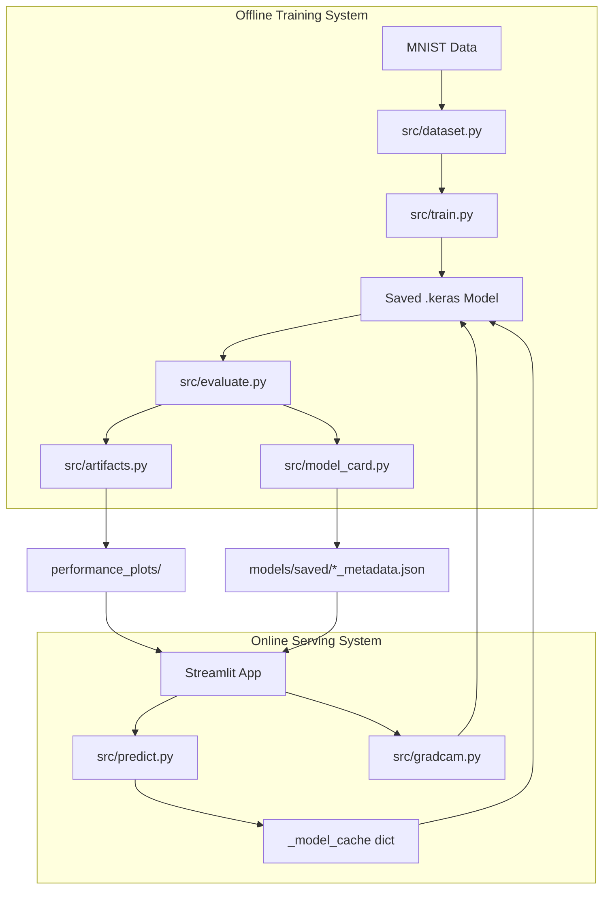
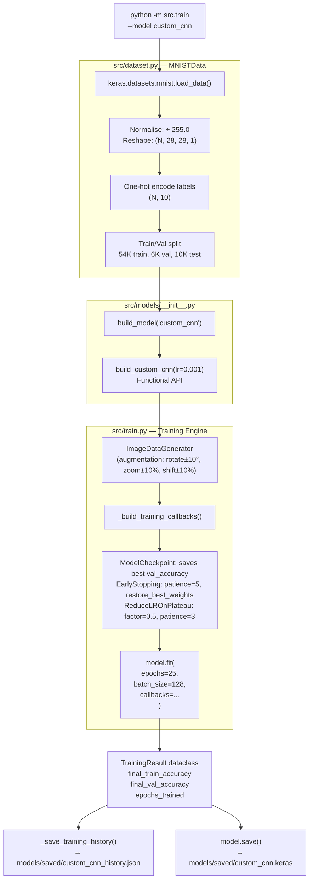
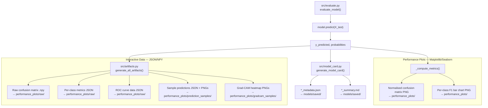
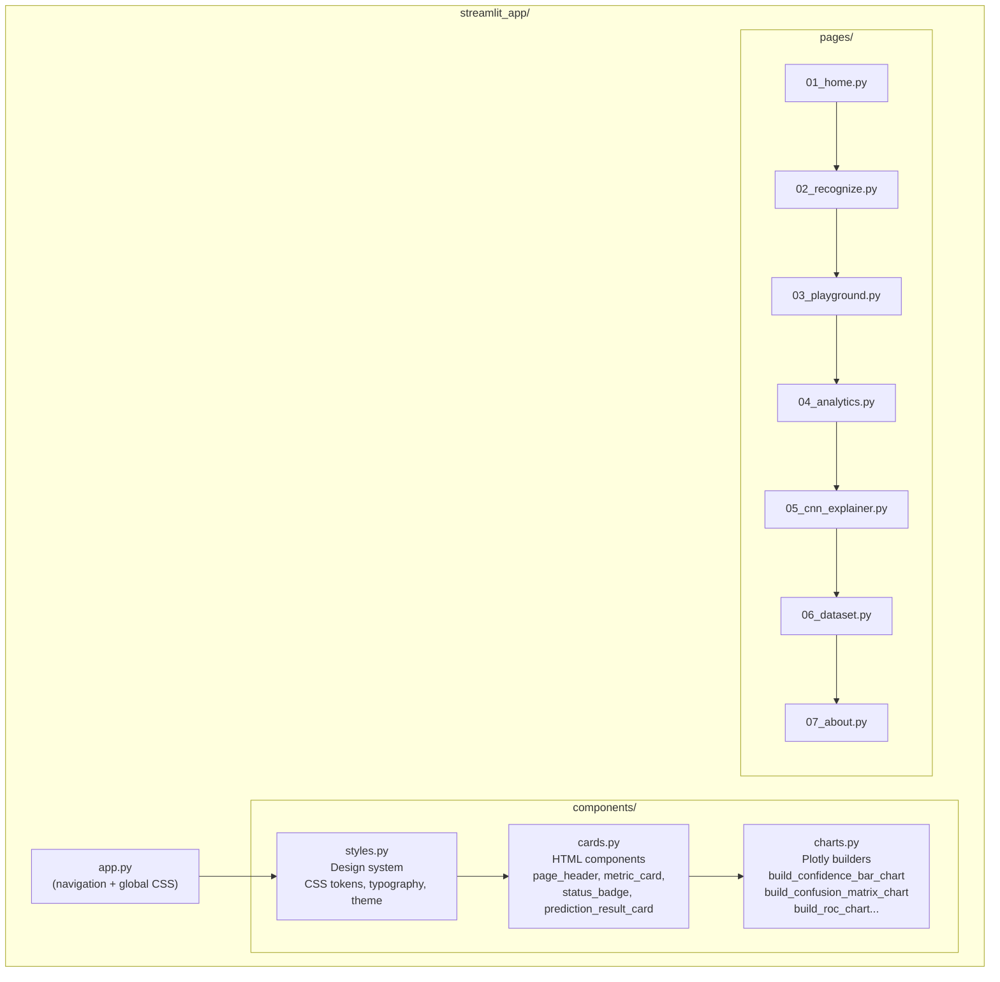

# DigitVision — System Architecture

> This document describes the design of the DigitVision system: how data flows,
> how components communicate, and why each architectural decision was made.

---

## Table of Contents

1. [System Overview](#system-overview)
2. [Data Flow](#data-flow)
3. [Training Pipeline](#training-pipeline)
4. [Inference Pipeline](#inference-pipeline)
5. [Artifact Generation Pipeline](#artifact-generation-pipeline)
6. [Streamlit Architecture](#streamlit-architecture)
7. [Configuration Architecture](#configuration-architecture)
8. [Design Decisions](#design-decisions)

---

## System Overview

DigitVision is divided into two distinct subsystems that share no runtime state:



**Key design principle:** The two subsystems communicate exclusively through files on disk.
Training writes models and artifacts; the Streamlit app reads them. This means:
- The app is always fast (no training at request time)
- Training can run headlessly on a server while the app runs locally
- Any artifact generation failure is non-fatal to the serving system

---

## Data Flow

### End-to-End: From Pixel to Prediction

```mermaid
flowchart LR
    A["User draws on canvas\n(280×280 RGBA)"] --> B

    subgraph "src/preprocessing.py"
        B["Extract alpha channel\n(280×280 uint8)"] --> C
        C["Invert: 255 - alpha\n(stroke → dark, bg → bright)"] --> D
        D["Resize to 28×28\n(INTER_AREA — area interpolation)"] --> E
        E["Normalize ÷ 255\n→ float32 [0, 1]"] --> F
        F["Reshape to (1, 28, 28, 1)"]
    end

    F --> G

    subgraph "src/predict.py"
        G["Load model from cache\n(or disk if first call)"] --> H
        H["model.predict(input)"] --> I
        I["argmax → predicted digit"] --> J
        J["PredictionResult dataclass"]
    end

    J --> K["Streamlit UI renders\nprediction card + confidence chart"]
```



### Canvas Inversion — Why It Works

The streamlit-drawable-canvas component uses the **alpha channel** (not RGB) as the
drawing signal. White strokes on a black background produce:
- `alpha = 255` where the user drew (the digit)
- `alpha = 0` everywhere else (the background)

MNIST expects the opposite: **white digit (255) on black background (0)**.

Inversion (`255 - alpha`) converts:
- Drawn stroke: `alpha=255 → 0` (black digit)
- Background: `alpha=0 → 255` (white background)

Wait — this is MNIST format: *white digit on black*? No. MNIST has **bright digits on dark backgrounds**.

The actual MNIST format is: pixel value 0 = background, pixel value 255 = digit stroke.
After inversion: stroke pixels become 0 (dark), background becomes 255 (bright).
After normalisation: stroke=0.0, background=1.0.

The MNIST training data has the same distribution: most pixels are background (close to 0).
The model learns that the *low-value minority pixels* (the actual digit strokes) encode
the shape. The inversion ensures canvas input has the same statistical distribution.

---

## Training Pipeline



### Callback Strategy

| Callback | Monitor | Rationale |
|----------|---------|-----------|
| `ModelCheckpoint` | `val_accuracy` | Saves the epoch with highest validation accuracy |
| `EarlyStopping` | `val_loss` | Stops when validation loss stops improving (more stable signal than accuracy) |
| `ReduceLROnPlateau` | `val_loss` | Halves LR after 3 epochs of no improvement |

`restore_best_weights=True` on EarlyStopping ensures the model in memory is always the
best checkpoint — not the final (potentially overfit) epoch.

### Why Data Augmentation?

MNIST is a "solved" dataset without augmentation. The reason we include it:

> "Real users don't draw perfect, centered, upright digits. They rotate,
> squish, shift, and draw at various scales. Augmentation teaches the model
> to be robust to exactly the kinds of variation it will see in production."

---

## Inference Pipeline

```mermaid
flowchart LR
    A["predict_from_canvas()\nor predict_from_upload()"] --> B

    subgraph "_load_model() — caching"
        B["model_name in _model_cache?"] -->|Yes| C
        B -->|No| D
        D["tf.keras.models.load_model(path)"] --> E
        E["_model_cache[name] = model"] --> C
        C["Return cached model"]
    end

    C --> F["model.predict(input, verbose=0)"]
    F --> G["probabilities: shape (1, 10)"]
    G --> H["_probabilities_to_result()"]

    subgraph "_probabilities_to_result()"
        H --> I["np.argmax → predicted_digit"]
        I --> J["probs[predicted_digit] → confidence"]
        J --> K["CLASS_NAMES → all_probabilities dict"]
        K --> L["PredictionResult (frozen dataclass)"]
    end
```



### Caching Strategy

The module-level `_model_cache: dict[str, tf.keras.Model]` prevents redundant model
loading across Streamlit reruns. Without this cache, every user interaction
(widget change, button click) would reload a ~50 MB model file.

The cache is keyed by model name. Streamlit's `@st.cache_resource` would also work,
but the module-level dict persists across page navigations — providing a lower-level,
always-available cache.

---

## Artifact Generation Pipeline



**Design decision — why two artifact types?**

- **Matplotlib PNGs** are fast to generate and work anywhere (no JavaScript needed).
  They appear in the About page and model cards.
- **Raw JSON/NPY** are loaded by Streamlit/Plotly to build interactive charts
  with hover tooltips and zoom/pan. This separation means the UI is decoupled
  from the evaluation code — the frontend never re-runs evaluation.

---

## Streamlit Architecture



### Component Architecture

Pages never define their own HTML. All visual elements come from one of three layers:

| Layer | Responsibility | Location |
|-------|---------------|---------|
| **Design Tokens** | Colours, typography, spacing, animation timings | `styles.py` |
| **Card Components** | Reusable HTML blocks (headers, metric cards, badges) | `cards.py` |
| **Chart Builders** | Plotly figures with consistent styling applied | `charts.py` |

This means:
- Changing the theme (e.g. switching to light mode) requires editing one file: `styles.py`
- Adding a new chart type requires adding one function to `charts.py`
- All pages automatically inherit any design system changes

---

## Configuration Architecture

All settings live in one file: `config/config.py`.

```python
# No magic numbers anywhere else in the codebase.
# Every value is derived from this file.

MODEL_TRAINING_CONFIG = {
    "custom_cnn": {"epochs": 25, "batch_size": 128, "learning_rate": 1e-3}
}
```

**Why a single config file instead of environment variables or YAML?**

For a project of this scope, a Python config file is the right choice:
- Type-checked by mypy / IDEs
- No YAML parsing overhead or syntax errors
- Paths are computed relative to `__file__` — works on any machine without setup
- Importable from tests, training scripts, and the UI without any parsing step

If the project grows to require per-environment overrides (dev/staging/prod),
the config can be extended with a `dataclass`-based settings pattern or `pydantic-settings`.
